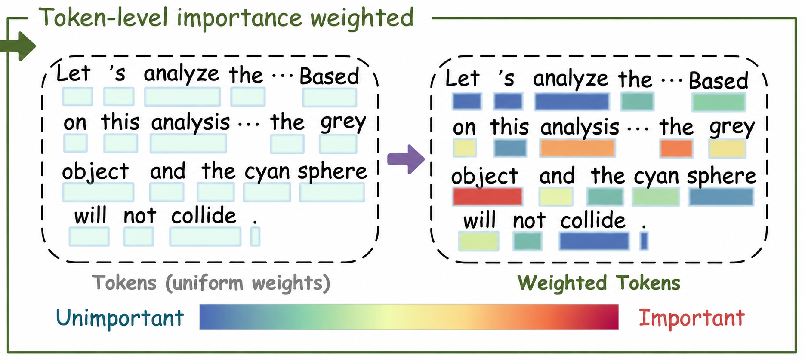

<div align="center">

# ER-TW-GRPO

### Reinforcing Video Reasoning with<br>Focused Thinking and Evidence Repair

</div>

## Contents

1. [Method](#method)
2. [Focused thinking](#focused-thinking)
3. [Evidence repair](#evidence-repair)
4. [Results](#results)
5. [Training dynamics](#training-dynamics)
6. [Reasoning examples](#reasoning-examples)
7. [Core code](#core-code)
8. [Quick start](#quick-start)
9. [Acknowledgements](#acknowledgements)

**TPAMI extension of *Reinforcing Video Reasoning with Focused Thinking* (ECCV 2026).**


*Focused thinking, soft rewards, and evidence repair provide complementary supervision.*

## Method


*Accepted repairs support local evidence learning and subsequent response distillation.*

## Focused thinking

<details>
<summary>ECCV · Focused thinking</summary>



*Token weighting emphasizes informative positions instead of treating all tokens equally.*


*High-weight positions frequently contain object, event, and temporal terms.*


*Token emphasis shifts toward collision descriptions over 500 training steps.*

### Positional weights


*Positional weights vary across the first 300 training samples.*

### Score dynamics


*Content-position scores evolve during training; the blue curve shows their smoothed trend.*

### Token examples


*Darker red highlights greater weights on object, event, and answer tokens.*

</details>

## Evidence repair


*Replacing one evidence slot triggers descendant replay and evidence-only supervision.*

### Repair example


*A transferred motion observation recovers answer A while preserving the cached B branch.*

## Results

| Method | Training | CLEVRER | NExT-GQA | MMVU-MC | MVBench | TempCompass |
| :-- | :-- | --: | --: | --: | --: | --: |
| ER-TW-GRPO (ours) | 1K RL + auxiliary | **55.2** | **77.8** | **65.9** | **64.4** | **73.3** |

<details>
<summary>ECCV · Baselines</summary>

| Method | Training | CLEVRER | NExT-GQA | MMVU-MC | MVBench | TempCompass |
| :-- | :-- | --: | --: | --: | --: | --: |
| LLaMA-VID | n/r | n/r | n/r | n/r | 41.9 | 45.6 |
| VideoLLaMA2 | n/r | n/r | n/r | 44.8 | 54.6 | n/r |
| LongVA-7B | n/r | n/r | n/r | n/r | n/r | 56.9 |
| Video-UTR-7B | n/r | n/r | n/r | n/r | 58.8 | 59.7 |
| Kangaroo-8B | n/r | n/r | n/r | n/r | 61.1 | 62.5 |
| Qwen2.5-VL-7B, zero-shot | n/r | 30.5 | 75.9 | 65.4 | 63.3 | 72.5 |
| Qwen2.5-VL-7B, CoT | n/r | 27.7 | 73.4 | 63.0 | 57.4 | 72.2 |
| Qwen2.5-VL-7B, SFT | 165K SFT | 29.0 | 69.0 | 61.3 | 59.4 | 69.2 |
| Video-R1-Zero | 4K RL | n/r | n/r | 63.8 | 60.4 | 70.9 |
| Video-R1 | 165K SFT + 4K RL | 31.6 | 74.3 | 64.2 | 62.7 | 72.6 |
| VideoRFT | 102K SFT + 8K RL | 12.8 | 74.2 | 64.5 | 61.4 | 72.1 |
| VideoChat-R1 | 18K RL | 29.2 | 76.0 | 64.2 | 63.1 | 72.9 |
| GRPO, fixed reward | 1K RL | 41.1 | 75.2 | 65.1 | 62.8 | 71.9 |
| TW-GRPO, soft reward | 1K RL | 50.4 | 76.1 | 65.8 | 63.3 | **73.3** |
| TW-GRPO, Video-R1 data | 4K RL | 32.0 | 76.3 | 65.6 | 64.2 | **73.3** |

</details>

## Training dynamics


*Reward dispersion and response length across 500 steps, before distillation.*

## Reasoning examples

<details>
<summary>ECCV · Reasoning examples</summary>


*TW-GRPO derives density from measured mass and displaced water volume.*

### Counterfactual reasoning


*Video-R1 and TW-GRPO reason differently about removing the metal cylinder.*

### Answer consistency


*TW-GRPO keeps its rationale and final answer consistent in this example.*

</details>

## Core code

| Core | Source |
|:--|:--|
| Token-weighted GRPO | [Trainer](src/open_r1/trainer/grpo_trainer.py) · [Rewards](src/open_r1/grpo.py) |
| Evidence repair | [Replay](src/open_r1/er/core.py) · [Collection](src/open_r1/er/collect.py) |
| Local learning & distillation | [Supervision](src/open_r1/er/supervision.py) · [Trainer](src/open_r1/trainer/er_trainer.py) · [Distillation](src/open_r1/er/distill.py) |

## Quick start

**2 × NVIDIA A100 · BF16 · ZeRO-3 CPU offload**

<details>
<summary>Install and train</summary>

Linux · Python 3.10.9+ · CUDA. Preinstall PyTorch 2.5.1 + torchvision 0.20.1.

```bash
git clone https://github.com/just-a-go/ER-TW-GRPO.git
cd ER-TW-GRPO
pip install -e '.[eval]' transformers==4.50.0 accelerate==1.2.1 wandb pillow
pip install -e './qwen-vl-utils[decord]'
pip install flash-attn==2.7.4.post1 --no-build-isolation
```

Local Qwen2.5-VL checkpoint; JSON/JSONL data; absolute video paths:

```json
{"problem": "Which statements are true? A. ... B. ...", "video": "/path/to/video.mp4", "solution": "<answer>A,B</answer>"}
```

```bash
export ER_MODEL=/path/to/Qwen2.5-VL-7B-Instruct
export ER_TRAIN_DATA=/path/to/train.json

# 1. Collect
CUDA_VISIBLE_DEVICES=0 bash scripts/er-collect.sh

# 2. Train
CUDA_VISIBLE_DEVICES=0,1 bash scripts/er-tw-grpo.sh

# 3. Distill
ER_MODEL=/path/to/Qwen2.5-VL-main-checkpoint \
  CUDA_VISIBLE_DEVICES=0,1 bash scripts/er-distill.sh
```

Checkpoint names must contain `Qwen2.5-VL`. Defaults: 2K collection questions, epoch-based training; adjust for the paper's 1K/500-step setting. `ER_LAMBDA=0`: no local learning.

</details>

## Acknowledgements

Special thanks to **[Reinforcing Video Reasoning with Focused Thinking](https://arxiv.org/abs/2505.24718) (ECCV 2026)**, the foundation of this extension, and its [TW-GRPO code](https://github.com/longmalongma/TW-GRPO).

<details>
<summary>Cite the ECCV paper · BibTeX</summary>

```bibtex
@inproceedings{dang2026twgrpo,
  author        = {Jisheng Dang and Jingze Wu and Teng Wang and Xuanhui Lin and Nannan Zhu and Hongbo Chen and Wei-Shi Zheng and Meng Wang and Tat-Seng Chua},
  title         = {Reinforcing Video Reasoning with Focused Thinking},
  booktitle     = {European Conference on Computer Vision (ECCV)},
  year          = {2026},
  url           = {https://arxiv.org/abs/2505.24718}
}
```

</details>

Thanks also to [Open R1](https://github.com/huggingface/open-r1), [Qwen-VL](https://github.com/QwenLM/Qwen2-VL), and the dataset authors.

[Apache-2.0](LICENSE).
