<div align="center">

# ER-TW-GRPO

### Reinforcing Video Reasoning with<br>Focused Thinking and Evidence Repair

**Focus on key tokens. Learn from partial answers. Repair failed evidence.**

</div>

## Contents

1. [Method](#method)
2. [Focused thinking](#focused-thinking)
3. [Evidence repair](#evidence-repair)
4. [Results](#results)
5. [Training dynamics](#training-dynamics)
6. [Reasoning examples](#reasoning-examples)
7. [Core code](#core-code)
8. [Quick start](#quick-start)

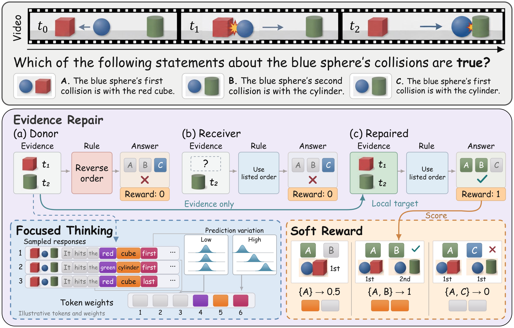

## Method

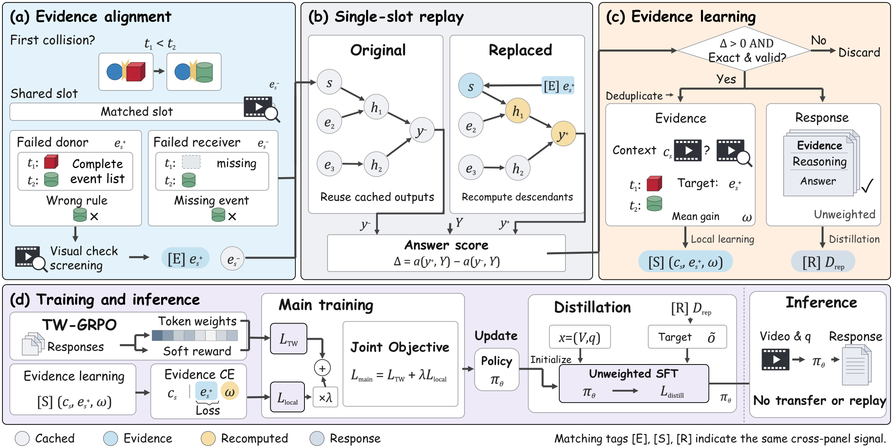

Transfer supported observations between failed responses. Replay affected reasoning. Learn from successful repairs.

## Focused thinking

TW-GRPO emphasizes object, event, and temporal tokens.

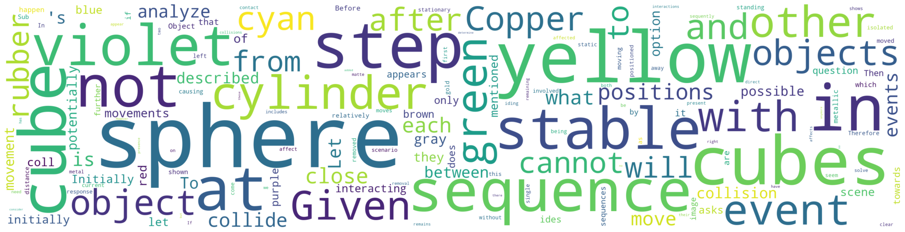

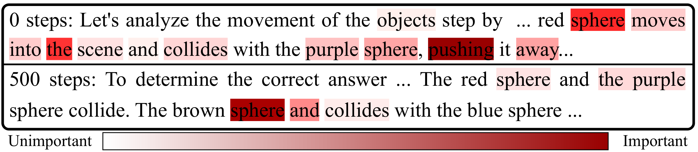

<details>
<summary>More token-level views</summary>

### Positional weights

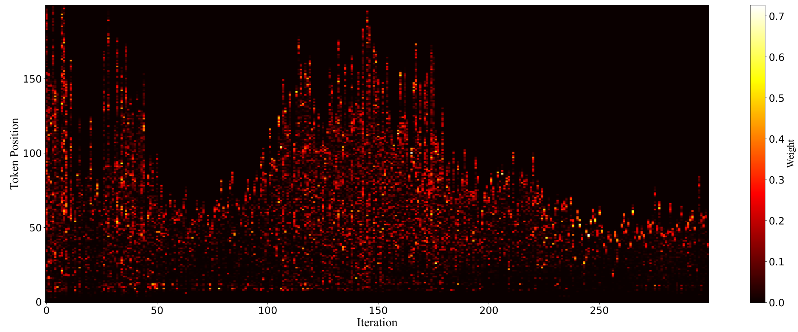

### Score dynamics

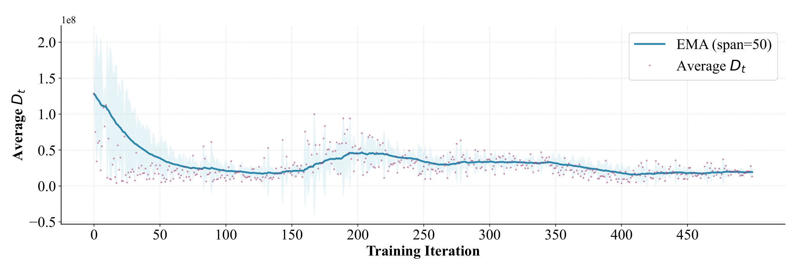

<sub>Conference implementation scales; not final bounded weights or calibrated KL scores.</sub>

### Token examples

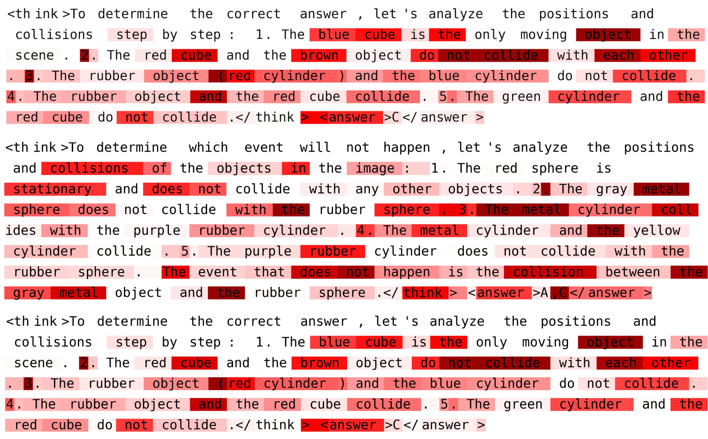

<sub>Darker red means greater weight, not verified visual correctness.</sub>

</details>

## Evidence repair

Replace one observation; replay only affected reasoning.

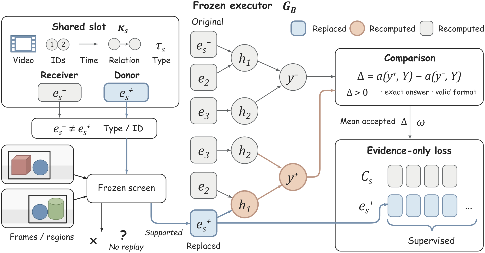

### Repair in action

One repaired observation recovers the complete answer in this schematic example.

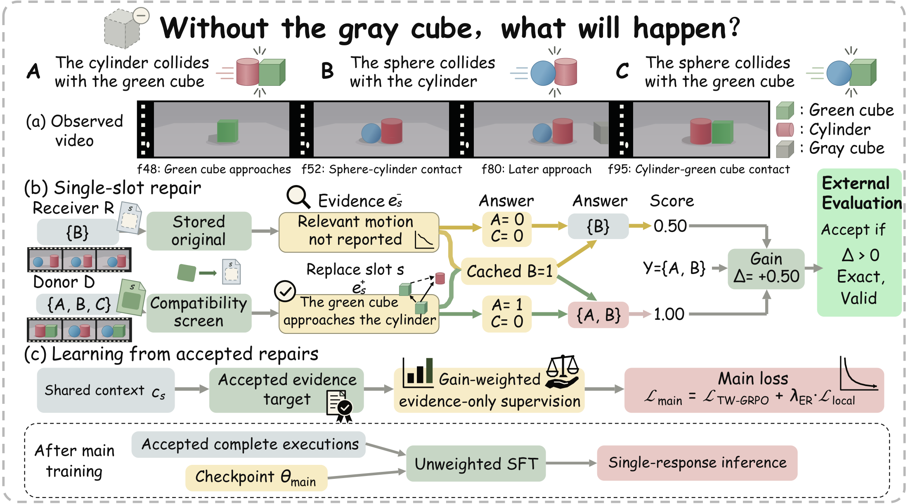

## Results

**1,000 training questions · +4.84 pp CLEVRER exact accuracy · Single-response inference**

CLEVRER: **50.35 → 55.19%**, averaged over three seeds.

| Method | CLEVRER | NExT-GQA | MMVU-MC | MVBench | TempCompass |
|:--|--:|--:|--:|--:|--:|
| TW-GRPO | 50.4 | 76.1 | 65.8 | 63.3 | 73.3 |
| **ER-TW-GRPO** | **55.2** | **77.8** | **65.9** | **64.4** | **73.3** |

<sub>Accuracy (%), paper Table I. TW-GRPO: conference reference; ER-TW-GRPO: seed 42, 1K questions and 500 base RL steps plus auxiliary learning and distillation.</sub>

## Training dynamics

Compared with TW-GRPO: lower late-stage reward dispersion and mostly shorter responses.

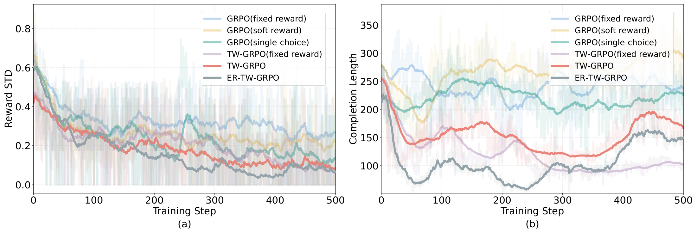

## Reasoning examples

TW-GRPO uses measured mass and displaced volume to infer density.

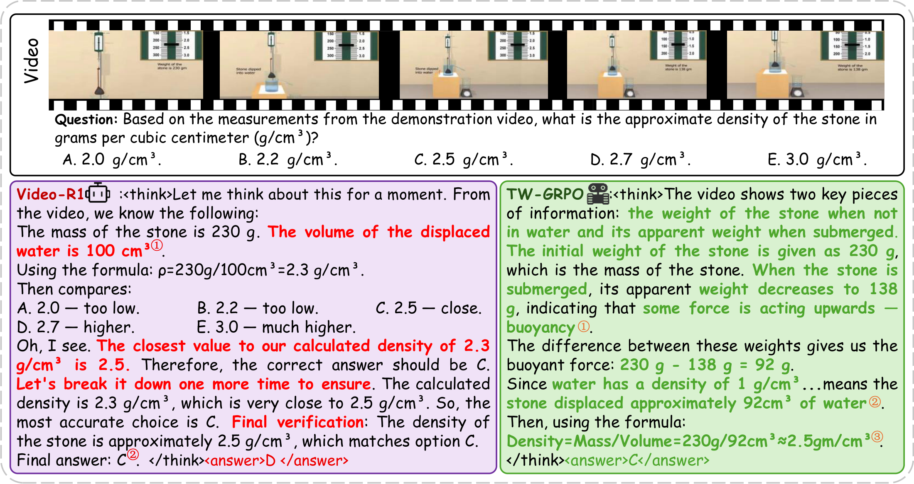

<details>
<summary>More examples: CLEVRER & MMVU</summary>

### Counterfactual reasoning

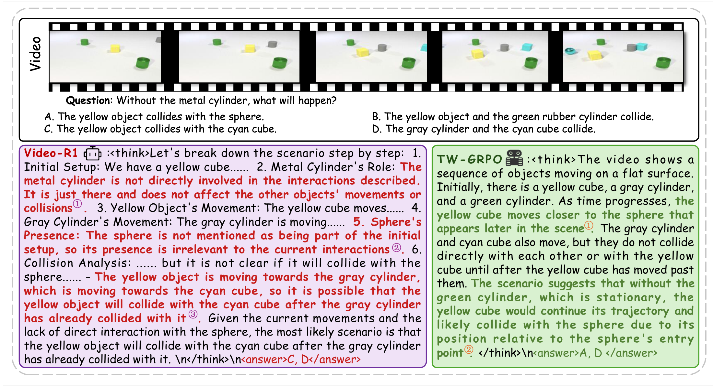

### Answer consistency

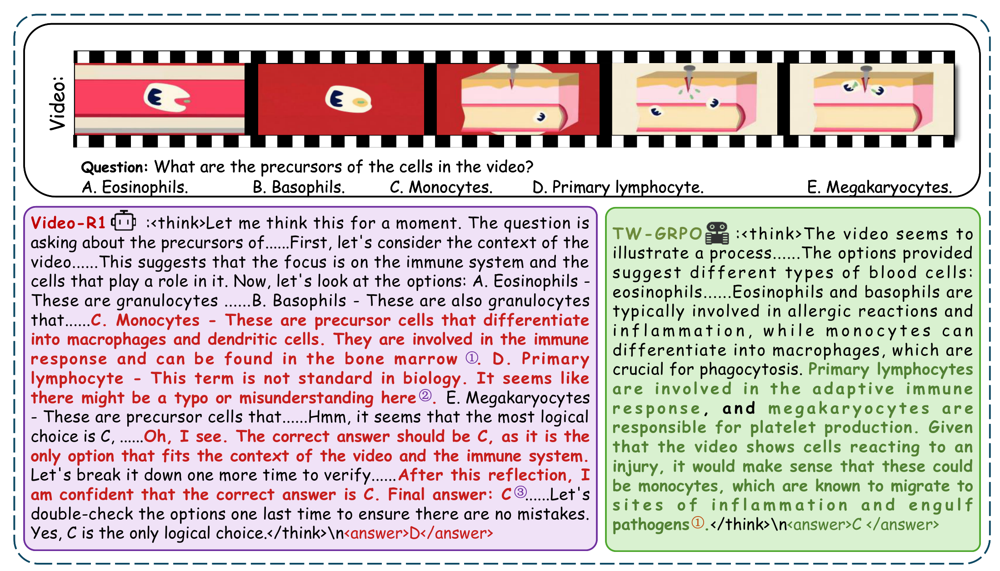

</details>

<sub>TW-GRPO examples and token visualizations are reproduced from the conference study.</sub>

## Core code

| Core | Source |
|:--|:--|
| Token-weighted GRPO | [Trainer](src/open_r1/trainer/grpo_trainer.py) · [Rewards](src/open_r1/grpo.py) |
| Evidence repair | [Replay](src/open_r1/er/core.py) · [Collection](src/open_r1/er/collect.py) |
| Local learning & distillation | [Supervision](src/open_r1/er/supervision.py) · [Trainer](src/open_r1/trainer/er_trainer.py) · [Distillation](src/open_r1/er/distill.py) |

## Quick start

**Hardware:** 2 × NVIDIA A100 · BF16 · DeepSpeed ZeRO-3 with CPU offload.

<details>
<summary>Install and train</summary>

Linux · Python 3.10.9+ · CUDA. Install PyTorch 2.5.1 and torchvision 0.20.1 for your CUDA environment first.

```bash
git clone https://github.com/just-a-go/ER-TW-GRPO.git
cd ER-TW-GRPO
pip install -e '.[eval]' transformers==4.50.0 accelerate==1.2.1 wandb pillow
pip install -e './qwen-vl-utils[decord]'
pip install flash-attn==2.7.4.post1 --no-build-isolation
```

Provide a local Qwen2.5-VL checkpoint and JSON/JSONL training data with absolute video paths:

```json
{"problem": "Which statements are true? A. ... B. ...", "video": "/path/to/video.mp4", "solution": "<answer>A,B</answer>"}
```

```bash
export ER_MODEL=/path/to/Qwen2.5-VL-7B-Instruct
export ER_TRAIN_DATA=/path/to/train.json

# 1. Collect evidence from the frozen checkpoint.
CUDA_VISIBLE_DEVICES=0 bash scripts/er-collect.sh

# 2. Train TW-GRPO with local evidence supervision (2 GPUs).
CUDA_VISIBLE_DEVICES=0,1 bash scripts/er-tw-grpo.sh

# 3. Distill from the completed main-training checkpoint (2 GPUs).
ER_MODEL=/path/to/Qwen2.5-VL-main-checkpoint \
  CUDA_VISIBLE_DEVICES=0,1 bash scripts/er-distill.sh
```

Keep `Qwen2.5-VL` in checkpoint directory names. Launchers use development defaults (2K collection questions, epoch-based training); configure the subset and budgets for the paper's 1K/500-step protocol. `ER_LAMBDA=0` selects TW-GRPO without local learning. The `eval` install extra supplies `math-verify`, imported by the training entry point.

</details>

---

Built on [TW-GRPO](https://github.com/longmalongma/TW-GRPO), Open R1, and Qwen-VL utilities. [Apache-2.0](LICENSE).
